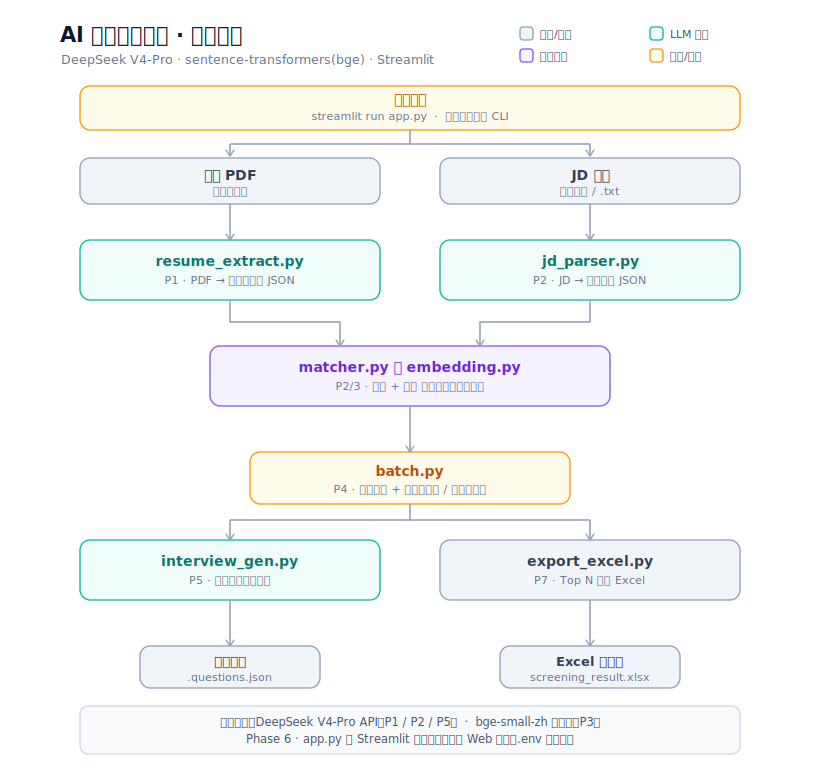

# AI 简历筛选助手

基于 **DeepSeek V4-Pro + 中文句向量**的简历自动筛选工具。上传简历 PDF 和岗位 JD，系统自动提取结构化信息、与岗位要求做**可解释的混合打分**、排序推荐，并为每位候选人生成针对性面试问题，支持一键导出 Excel。

## 功能

- **批量筛选**：粘贴 JD、上传多份简历 PDF，一键得到按匹配分排序的候选人列表。
- **单份详情**：查看每位候选人提取出的结构化信息、逐维度的匹配分析（命中 / 缺口 + 证据），以及按其亮点和缺口生成的面试问题。
- **导出结果**：勾选 Top N 导出带格式的 Excel 排名表（含每维度得分）。

## 系统架构



数据流：简历 PDF / JD 文本 → 结构化提取（LLM）→ 规则 + 语义混合打分 → 排序 → 面试题生成 / Excel 导出。

## 技术栈

| 环节 | 选型 |
| --- | --- |
| LLM | DeepSeek V4-Pro（官方 API，OpenAI 兼容）— 简历提取、JD 解析、面试题生成 |
| 句向量 | sentence-transformers `bge-small-zh-v1.5` — 技能语义兜底、经历相关度 |
| PDF 解析 | pdfplumber |
| 数据模型 / 校验 | pydantic |
| Web 界面 | Streamlit |
| Excel 导出 | openpyxl |

## 目录结构

```
resume_extract.py    P1   PDF → LLM 提取 → 简历 JSON（含 ResumeProfile 模型）
jd_parser.py         P2   JD 文本 → 结构化要求（JDRequirement）
matcher.py           P2/3 规则 + Embedding 混合打分（MatchResult，可解释）
embedding.py         P3   中文句向量相似度（懒加载 + 缓存）
batch.py             P4   批量提取 + 匹配 + 排序（缓存、失败隔离）
interview_gen.py     P5   按亮点 / 缺口生成面试题（InterviewKit）
app.py               P6   Streamlit Web 界面（串起全部模块）
export_excel.py      P7   Top N 导出 Excel
architecture.svg          本架构图
sample_jd.txt             示例 JD，便于快速试跑
.env / .env.example       DeepSeek API Key 配置
.gitignore                忽略密钥与简历数据
```

## 安装

需要 Python 3.9+。

```bash
pip install pdfplumber openai pydantic python-dotenv sentence-transformers streamlit openpyxl
```

首次启用语义匹配会自动下载 bge 模型（约 90MB，需联网一次，CPU 即可运行）。

## 配置

复制 `.env.example` 为 `.env`，填入 DeepSeek API Key（在 https://platform.deepseek.com 获取）：

```
DEEPSEEK_API_KEY=sk-你的key
```

`.env` 已被 `.gitignore` 忽略，不会进版本库。

## 使用

### Web 界面（推荐）

```bash
streamlit run app.py --server.headless true
```
粘贴 JD → 上传简历 PDF → 开始筛选 → 查看排序表与详情 → 导出 Excel。

### 命令行（按阶段）

```bash
# 单份：提取简历
python resume_extract.py 简历.pdf                          # 生成 简历.json

# 单份：JD 解析 + 匹配
python matcher.py 简历.json sample_jd.txt                  # 混合打分
python matcher.py 简历.json sample_jd.txt --no-embedding   # 纯规则（用于对比）

# 单份：面试题
python interview_gen.py 简历.json sample_jd.txt

# 批量：处理一个文件夹的简历
python batch.py resumes/ sample_jd.txt                     # 生成 resumes/batch_results.json

# 导出 Excel
python export_excel.py resumes/batch_results.json --top 10 -o shortlist.xlsx
```

## 打分逻辑（可解释性）

匹配分不是一个黑盒数字，而是若干维度的加权和，每个维度都带证据，可逐项倒推。

| 维度 | 权重（混合 / 纯规则） | 方法 |
| --- | --- | --- |
| 必备技能 | 0.50 / 0.60 | 先精确 / 别名匹配（规则），未命中再用句向量相似度兜底（≥ `SEM_THRESHOLD`），命中方式记为 exact / alias / semantic(0.xx) / miss |
| 经历相关 | 0.25 / — | JD 职责与简历经历要点的语义相似度（仅混合模式） |
| 经验年限 | 0.15 / 0.25 | 达标满分，差多少扣多少 |
| 加分项 | 0.10 / 0.15 | 同技能机制，低权重 |

总分 = Σ(权重 × 维度分) × 100。`highlights` / `gaps` 由命中情况派生，直接驱动详情页展示与面试题生成。

可调参数（均在 `matcher.py`）：语义阈值 `SEM_THRESHOLD`、别名表 `ALIAS`、各维度权重。

## 评估建议（对照交付要求）

- **提取准确率**：取 20+ 份简历，字段级人工对比。
- **匹配合理性**：人工 Top-5 与系统 Top-5 的一致性。
- **消融对比**：同一批数据分别跑混合模式与 `--no-embedding`，比较技能命中率与排序差异，量化 embedding 的增益。
- **面试题质量**：对不同 prompt 策略（零样本 / 带范例）人工打分。

## 已知限制 & 后续方向

- 仅支持文本型 PDF；扫描件需接 OCR。
- DeepSeek 为文本输入模型，简历需先转文本（流程中已用 pdfplumber 处理）。
- `bge-small-zh` 偏中文，"中文 JD + 英文技能词"的跨语言匹配可能偏弱，可换多语模型（如 `paraphrase-multilingual-MiniLM`）或扩充别名表。
- 简历含个人信息，走 API 会上传到 DeepSeek 服务器；真实场景需评估隐私合规。
